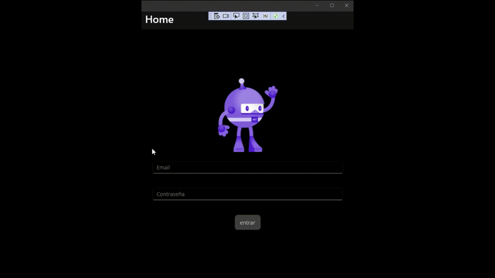
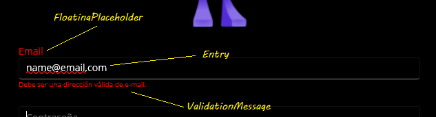

# ValidatableEntryText
An Entry Control for .NET MAUI with added features, including a floating Placeholder and validation features.



It's use is straightforward, and can be fully defined in XAML. This corresponds to the above animation
```
 <VerticalStackLayout
            Spacing="25"
            Padding="30,0"
            VerticalOptions="Center">

           [...]

            <cc:ValidatableEntry 
                x:Name="EmailEntry"
                FloatingPlaceholderErrorColor="Red"
                FloatingPlaceholderNormalColor="Green"
                ValidationMessageColor="Red"
                ValidationMessageFontSize="10"
                Placeholder="{x:Static res:AppRes.email_placeholder}">
                <cc:ValidatableEntry.ValidationRules>
                    <cc:IsValidEmailRule ErrorMessage="{x:Static res:AppRes.email_error}"/>
                </cc:ValidatableEntry.ValidationRules>
            </cc:ValidatableEntry>
            <cc:ValidatableEntry 
                x:Name="PasswordEntry"
                FloatingPlaceholderErrorColor="Red"
                FloatingPlaceholderNormalColor="Green"
                ValidationMessageColor="Red"
                ValidationMessageFontSize="10"
                IsPassword="True"
                ValidateOnTextChanged="True"
                Placeholder="{x:Static res:AppRes.password_placeholder}">
                <cc:ValidatableEntry.ValidationRules>
                    <cc:MinLengthRule MinLength="5" 
                                      ErrorMessage="{x:Static res:AppRes.password_length_error}"
                                      />
                    <cc:RegexRule RegexRuleStr="[a-z]"
                                  ErrorMessage="{x:Static res:AppRes.password_contains_lowercase_error}"
                                  />
                    <cc:RegexRule RegexRuleStr="[A-Z]"
                                  ErrorMessage="{x:Static res:AppRes.password_contains_upercase_error}"
                                  />
                    <cc:RegexRule RegexRuleStr="[0-9]"
                                  ErrorMessage="{x:Static res:AppRes.password_contains_digit_error}"
                                  />
                    <cc:RegexRule ErrorMessage="{x:Static res:AppRes.password_contains_symbol_error}"
                                  >
                        <cc:RegexRule.RegexRuleStr>[$-/:-?{-~#!"^_`\[\]]</cc:RegexRule.RegexRuleStr>
                    </cc:RegexRule>
                </cc:ValidatableEntry.ValidationRules>
            </cc:ValidatableEntry>


[...]

        </VerticalStackLayout>
```

It is made up of the following parts:



 - The **Entry** itself
 - The **FloatingPlaceholder**. It is only visible when the Entry is not empty.
 - The **ValidationMessage**: When a rule is not met, an Error Message will be displayed here. Only one message will be displayed at a time.
 
## Validation Rules ##
There are a few predefined validation rules, such as *MinLengthLRule*, *MaxLengthRule* or *IsValidEmailRule*. For broader cases, a *RegexRule* validation 
type exists, where a pattern that satisfies the rule can be provided. Additionaly, a custom rule can also be created by implementing the IValidationRule interface.

### IValidationRule ###
```
 public interface IValidationRule
    {
        bool Validate(string text);
        string ErrorMessage { get; set; }
    }
```
All validation rules must implement this interface. It consists of a *Validate* method and a *ErrorMessage* string. The Message will be displayed as a Validation 
Message when the Validate method returns *False*.

### MinLengthRule ###
This rules has the property *MinLength*. If the entered string's length is above this threshold, the rule is satisfied.
Example:

### MaxLengthRule ###
This rules has the property *MaxLength*. If the entered string's length is below this threshold, the rule is satisfied.

### IsValidURLRule ###
This rule is satisfied if the input string is a valid URL.

### IsValidEmailRule ###
The rule is satisfied if the input string is a valid Email address

### RegexRule ###
This rule has the *RegexRuleStr* property. This string should be a valid Regex pattern, otherwise an exception will occur.
The input string is matched against this rule, using the *IsMatch* method of *System.Text.ReularExpressions*. If the match is satisfied, the rule is satisfied.
## Allowed Characters ##
Often, it can be useful to limit the characters the user is allowed to enter to a limited set. The AlloweCharctersSet property allows just that. Simply enter into this string all the characters that should be allowed. If this string is empty, no restrction is applied.
### Examples ###
#### Allow only numeric characters ####
```
AllowedCharactersSet = "0123456789"
```
#### Allow only numeric characters with punctuation ####
```
AllowedCharactersSet = "0123456789.,"
```
#### Allow only lowercase letters ####
```
AllowedCharactersSet = "qwertyuiopasdfghjklzxcvbnm"
```
#### Allow everything ####
```
AllowedCharactersSet = ""
```

## Properties ##
### Entry:Microsoft.Maui.Controls.Entry ###
An Ordinary MAUI Entry that is the basis for this control.
### FloatingPlaceholder: Microsoft.Maui:Controls:Label ###
A Label that appears on top of the Entry, when the contents of Entry are not empty. 
The text in this label is always the same as Entry's placeholder value.

### ValidationMessage: Microsoft.Maui:Controls:Label ###
A Label that appears below Entry when a validation is not passed. It shows the content
of that Validation's ErrorMessage.

### IsNeverValidated:bool ###
This value is true if the Validations on the ValidatableEntry have never been run. It is a readonly value.

### FontSize ###
The FontSize Property of Entry.

### FontFamily ###
FontFamily Property of Entry, FloatingPlaceholder and ValidationMessage.

### PlaceholderInsideColor: Microsoft.Maui.Graphics.Color ###
PlaceholderColor property of Entry

### FloatingPlaceholderFontSize : double  ###
FontSize property of FloatingPlaceholder.

### FloatingPlaceholderNormalColor : Microsoft.Maui.Graphics.Color  ###
FontColor property of FloatingPlaceholder, when the validation is successfull.

### FloatingPlaceholderErrorColor: Microsoft.Maui.Graphics.Color ###
FontColor property of FloatingPlaceholder, when the validation is not successfull.

### ValidationMessageColor: Microsoft.Maui.Graphics.Color ###
FontColor property ValidationMessage

### ValidationMessageFontSize : double ###
FontSize property of ValidationMessage

### IsPassword : bool ###
IsPassword property of Entry

### Placeholder : string ###
Defines both the Placeholder property of Entry and the Text property of FloatingPlaceholder.

### ValidationErrorMessage:string ###
The Text property of ValidationMessage. This property is normally not interacted width.

### Text : string ###
The Text property of Entry

### ValidationRules : List<IValidationRule> ###
The list of validations that apply to this ValidatableEntry. The *Validate* method in each will be run, in order, when 
the *RunValidations* method is executed, until one of them fails.

### IsValid : bool###
It is false by default. Becomes true after the *RunValidations* method is run and all validations are satisfied.

### ValidateOnTextChanged : bool ###
If true, the *RunValidations* method is run after every character change in Entry.

### ValidateOnFocusLost : bool ###
If true, the *RunValidations* method is run after Entry looses focus.

## Public Methods ##
### RunValidations ### 
Iterates through the list ValidationRules, running their *Validate* method using the Entry's content as the input parameter
If one of the validations fails (returns false), ValidationError's Text property is set to the validation's ErrorMessage. And
the method returns.

## Events ##
### ValidationStateChanged : EventHandler<bool> ###
This event fires when the status of IsValid changes. It carries a bool parameter which indicates the new value.

